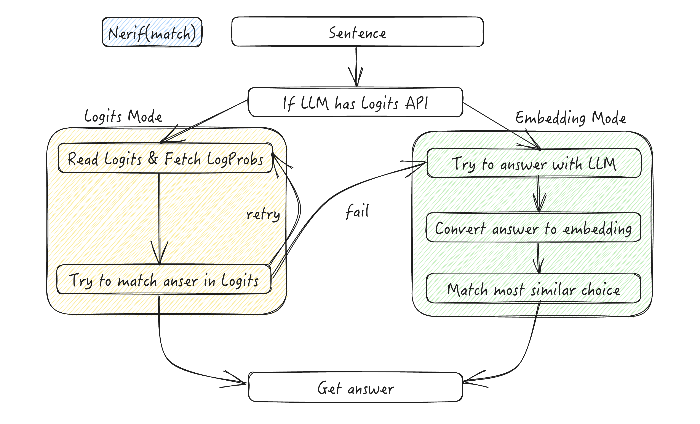

# Nerif Log

<!-- Core component in Nerif project is `nerification`, `nerif` and `nerif_match`.

## Nerification

Nerification := Not only Verification

Base class: NerificationBase

This class is used to verify the result of the Nerif.
This class provides base functionality for verifying and matching values against a predefined set of possible values.

Attributes:

- `original_options (List[Any])`: Original list of possible values before conversion
- `possible (List[str])`: List of possible values converted to lowercase strings 
- `embedding (SimpleEmbeddingAgent)`: Agent used for generating embeddings

Methods:

- `convert(val: Any) -> str`: Converts a value to lowercase string format

- `verify(val: Any) -> bool`: Checks if a value exists in the possible values list

- `simple_fit(val: Any)`: Uses embeddings to find the closest matching possible value

- `force_fit(val: Any, similarity="cosine")`: Uses embeddings to find the closest matching possible value

Based on the base method, we implement different value check strategy:

`Nerification`, `NerificationInt` and `NerificationString`

Example:

```python
from nerif.core import Nerification
from nerif.core import NerificationInt
from nerif.core import NerificationString

nerification = Nerification(model="text-embedding-3-large")

print(nerification.simple_fit("yes, it is"))
# result: None
print(nerification.force_fit("yes, it is"))
# result: True
print(nerification.simple_fit("true"))
# result: True
print(nerification.force_fit("true"))
# result: True

nerification_int = NerificationInt(model="text-embedding-3-large", possible_values=[1, 233, 343])

print(nerification_int.simple_fit(1))
# result: 1
print(nerification_int.force_fit(1))
# result: 1
print(nerification_int.simple_fit(233))
# result: 233
print(nerification_int.force_fit("The value is 233"))
# result: 233
print(nerification_int.simple_fit(343))
# result: 343
print(nerification_int.force_fit("The value is 343"))
# result: 343

nerification_string = NerificationString(model="text-embedding-3-large", possible_values=["YES", "NO"])

print(nerification_string.simple_fit("yes"))
# result: YES
print(nerification_string.force_fit("Well, I guess you are right"))
# result: YES
print(nerification_string.simple_fit("no"))
# result: NO
print(nerification_string.force_fit("Oh, I don't think so"))
# result: NO
```

## Nerif & Nerif Match



### Overview

The Nerif and Nerif Match components provide robust mechanisms for controlling and interpreting LLM outputs. They address common challenges like overly verbose responses or inconsistent formatting by using a dual-mode approach: logits mode and embedding mode.

### How It Works

LLM outputs can sometimes be unpredictable - they may include unnecessary pleasantries or irrelevant information. To handle this, we employ two strategies:

1. **Logits Mode**
   - Uses the LLM's logits API to get top-k most probable token outputs
   - Faster but may be less accurate
   - Not available on all LLM services

2. **Embedding Mode**
   - Activates if logits mode fails or is unavailable (You can also call embedding mode directly)
   - Generates analysis of the input and compares embeddings with possible options
   - More reliable but slower
   - Guarantees a result in one attempt

The workflow diagram above illustrates this process.

### Nerif Class

The Nerif class evaluates the truthfulness of statements using both logits and embedding modes.

**Attributes:**
- `model: str` - LLM model name (default: NERIF_DEFAULT_LLM_MODEL)
- `embed_model: str` - Embedding model name (default: NERIF_DEFAULT_EMBEDDING_MODE)
- `temperature: float` - Model temperature, defaults to 0
- `counter: Optional[NerifTokenCounter]` - Token usage counter
- `debug: bool` - Debug mode flag

**Key Methods:**
- `logits_mode(text: str) -> bool` - Evaluates using logits analysis
- `embedding_mode(text: str) -> bool` - Evaluates using embedding comparison
- `judge(text: str, max_retry: int = 3) -> bool` - Main evaluation method
- `instance(text: str, max_retry: int = 3, model: str = NERIF_DEFAULT_LLM_MODEL, debug: bool = False) -> bool` - Creates and runs a new instance

Example:

```python
```

### Nerif Match Class

The Nerif Match class selects the best matching option from a list of choices.

**Attributes:**
- `choices: List[str]` - Available options to match against
- `model: str` - LLM model name (default: NERIF_DEFAULT_LLM_MODEL)
- `embed_model: str` - Embedding model name (default: NERIF_DEFAULT_EMBEDDING_MODEL)
- `temperature: float` - Model temperature, defaults to 0
- `counter: Optional[NerifTokenCounter]` - Token usage counter

**Key Methods:**
- `logits_mode(text: str) -> int` - Matches using logits analysis
- `embedding_mode(text: str) -> int` - Matches using embedding comparison
- `match(text: str, max_retry: int = 3) -> int` - Main matching method
- `instance(choices: List[str], text: str, max_retry: int = 5, model: str = NERIF_DEFAULT_LLM_MODEL, embed_model: str = NERIF_DEFAULT_EMBEDDING_MODEL, debug: bool = False, counter: Optional[NerifTokenCounter] = None) -> int` - Creates and runs a new instance

Example:

```python
``` -->